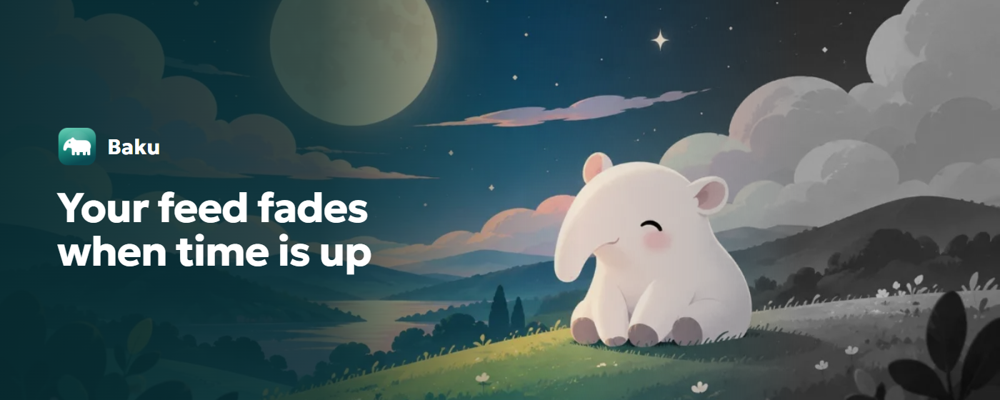
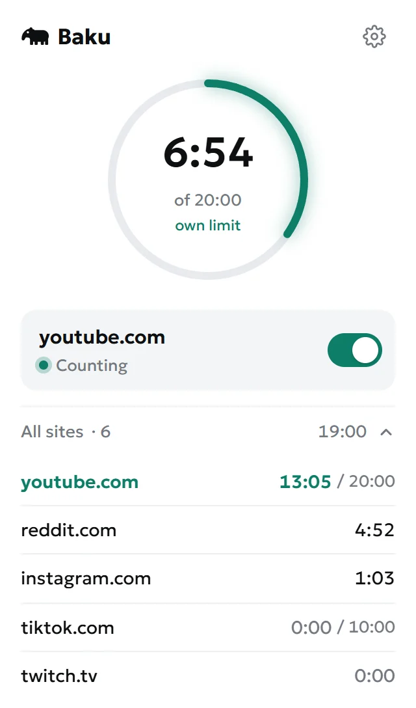
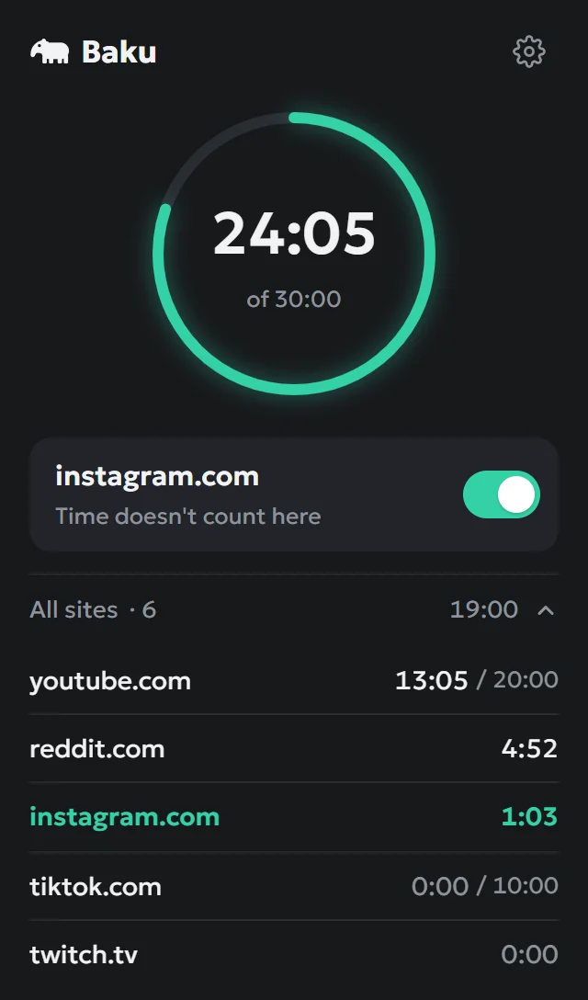

<p align="center"></p>

<h1 align="center">Baku</h1>

<p align="center"><b>Time's up. So is the color.</b><br>
Distracting sites slowly fade to gray when your daily limit runs out. Nothing gets blocked, they just stop being fun.<br>
<sub>Время вышло — краски тоже. Сайты, где залипаешь, плавно выцветают в серый, когда дневной лимит кончился.</sub></p>

<p align="center"><a href="https://dvmnum.github.io/baku">Website</a> · <a href="https://dvmnum.github.io/baku/privacy.html">Privacy</a> · <a href="https://boosty.to/dvmnum/donate">Support on Boosty</a></p>



> In Japanese folklore the baku is a spirit that comes at night and eats bad dreams.
> This one eats doomscrolling: it doesn't scold or forbid, it just quietly takes the color out of your feed when it's time for a break.

## What it does

- **Fades instead of blocking.** No block pages, no lock screens. When time is up, the site slowly turns gray and dims a little, and scrolling on just isn't fun anymore. You choose how gray (60%, 80% or fully) and how fast (30 s, 2.5 or 10 min).
- **Counts honestly.** Time runs only while you scroll, click, type or watch a video on a tracked site. A tab in the background, or you away from the keyboard, doesn't count.
- **One shared limit, or a site's own.** Give YouTube 20 minutes and TikTok 10; everything else shares one daily limit.
- **Messages don't count.** VK messages, Instagram Direct, X messages, Reddit chat and YouTube Studio never cost time and never fade. Add your own pages per site.
- **5 more minutes, after a breath.** You can extend, but the button fills slowly for five seconds first, and only twice a day.
- **Private by design.** No server, no accounts, no analytics. Nothing leaves the browser, and the extension gets access only to the sites you add, one by one.

<table>
  <tr>
    <td width="50%"></td>
    <td width="50%"></td>
  </tr>
  <tr>
    <td align="center"><sub>Time left today, the current site, every site's time</sub></td>
    <td align="center"><sub>On a messages page nothing is counted</sub></td>
  </tr>
</table>

Light and dark themes follow the system. The UI speaks English and Russian.

## Install

Chrome Web Store (also for Edge, Yandex Browser, Opera, Brave, Vivaldi) — coming soon, then Firefox Add-ons. Links will be on the [website](https://dvmnum.github.io/baku).

From source:

```bash
npm install
npm run build
```

Then `chrome://extensions` → Developer mode → **Load unpacked** → `.output/chrome-mv3`.

## Development

Built with [WXT](https://wxt.dev) and TypeScript. Popup, settings and onboarding are plain DOM, no framework.

```bash
npm run dev            # Chrome with hot reload
npm run typecheck
npm run test:e2e       # Playwright: builds a test variant and runs the smoke suite
npm run zip            # store package → .output/baku-<version>-chrome.zip
npm run zip:firefox    # Firefox package + sources zip for AMO
npm run store          # store screenshots and site images from the real UI
npm run icons          # PNG icons from assets/icon.svg
npm run privacy        # site/privacy.html from store/privacy-policy.md
```

The test build (`--mode e2e`) grants host permissions up front, because automated tests can't click permission prompts. Never ship it.

<details>
<summary><b>Structure</b></summary>

```
entrypoints/
  background.ts   time accounting (heartbeats → storage), content-script registration, toolbar badge
  content.ts      activity detection, heartbeats, the grayscale filter
  popup/          time-left ring, current site, folded list of all sites, "5 more minutes"
  options/        daily limit, sites with own limits and excluded pages, fade settings
  welcome/        onboarding on first install
utils/
  state.ts        settings and usage, limit and fade math
  domain.ts       domain matching and aliases (vk.com ↔ vk.ru, x.com ↔ twitter.com)
  exclusions.ts   built-in excluded pages (messengers)
  i18n.ts         chrome.i18n helpers with plurals
public/_locales/  en, ru
site/             the website on GitHub Pages
store/            store listing texts, policy, screenshots
```
</details>

<details>
<summary><b>Design notes</b></summary>

- **No host permissions at install.** Each site is requested through `optional_host_permissions` when you add it, and the fade script is registered with `scripting.registerContentScripts` only for granted sites.
- **The MV3 service worker sleeps,** so there are no timers in the background. Content scripts send a heartbeat every 5 s and the background credits `min(now − lastBeat, 5 s)`. `lastBeat` lives in `storage.session`, so parallel tabs never double count and a worker restart loses nothing.
- **Focus isn't required.** The popup, screen recorders and devtools steal window focus while you keep scrolling underneath; visible tab + recent input is what counts.
- **The filter goes on `<html>`,** which keeps `position: fixed` elements working.
- **Excluded pages and domain aliases are data,** not per-site code: tables in `utils/exclusions.ts` and `utils/domain.ts`.
</details>

Project notes for contributors live in [`CLAUDE.md`](CLAUDE.md).

## How it's made

Baku is built with [Claude Code](https://claude.com/claude-code). The idea, design and every product decision are by [@dvmnum](https://github.com/dvmnum); most of the code was written by Claude.

## Support

Baku is free and ad-free. If it helped you scroll less, you can [support the author on Boosty](https://boosty.to/dvmnum/donate).

## License

Copyright © 2026 dvmnum. The code is under the [GNU General Public License v3.0 or later](LICENSE): you can use, study, change and share it, and anything you distribute that's built on it must stay open under the same license.

The name Baku, the icon (`assets/icon.svg`, `public/icon/`) and the illustration (`public/img/baku-night.webp`, generated with ChatGPT for this project) are not covered by the code license and remain © dvmnum. Forks must use their own name and artwork.

The bundled font [Geologica](https://github.com/monokromskriftforlag/geologisk) is under the SIL Open Font License 1.1 (`public/fonts/OFL.txt`).
